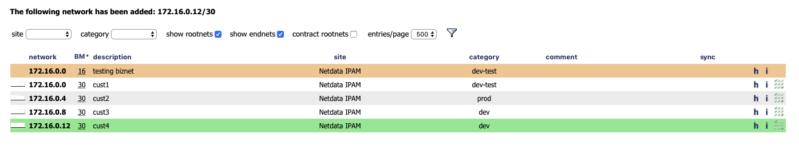
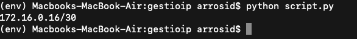

# gestioip_free_network
Get Available Network Range From GestioIP

GestióIP (https://www.gestioip.net/) is an automated, Web based IPv4/IPv6 address management (IPAM) software. It features powerful network discovery functions and offers search and filter functions for both networks and host, permitting Internet Search Engine equivalent expressions. This lets you find the information that administrators frequently need easily and quickly.

To install GestioIP, you can follow official documentation from http://brucknet.de/gestioip/docu/GestioIP_3.4_Installation_Guide.pdf

This is what GestioIP look like.

We can see in the picture above that we have root network 172.16.0.0/16, also we can see that the last usable network is 172.16.0.12/30. To get next free network range, you can use the script that i have writed. 

To use this script, firstly you need to install requirements pyhton libraries in requirements.txt, after that you just need to run script.py and you will find next free network range

